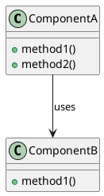

## Architectural Diagram Inline Example

This may be practical for smaller diagrams.

```puml
@startuml
!define RECTANGLE class
RECTANGLE ComponentA {
  +method1()
  +method2()
}

RECTANGLE ComponentB {
  +method1()
}

ComponentA --> ComponentB : uses
@enduml
```