# Simulation Job Queue System - Architecture Diagrams

## 1. System Context Diagram (C1)

```mermaid
graph TB
    subgraph External Users
        Researcher[👤 Researcher<br/>Submits and monitors simulations]
        Admin[👤 System Administrator<br/>Manages configuration]
    end
    
    SimSystem[🎯 Simulation System<br/>Manages simulation jobs with<br/>consistent terminology]
    
    subgraph External Systems
        Machinery[⚙️ Machinery Queue<br/>Distributed task queue]
        Lambda[☁️ AWS Lambda<br/>Serverless compute]
        SQS[📬 AWS SQS<br/>Message queue]
        Redis[💾 Redis<br/>In-memory store]
        Monitoring[📊 Monitoring<br/>Prometheus/Grafana]
    end
    
    Researcher -->|HTTPS| SimSystem
    Admin -->|HTTPS| SimSystem
    SimSystem -->|Machinery Protocol| Machinery
    SimSystem -->|AWS SDK| Lambda
    SimSystem -->|AWS API| SQS
    Machinery -->|Redis Protocol| Redis
    SimSystem -->|Metrics| Monitoring
    
    style SimSystem fill:#d4edda,stroke:#28a745,stroke-width:3px
    style Machinery fill:#f8d7da,stroke:#721c24,stroke-width:2px
    style Lambda fill:#f8d7da,stroke:#721c24,stroke-width:2px
    style SQS fill:#f8d7da,stroke:#721c24,stroke-width:2px
    style Redis fill:#f8d7da,stroke:#721c24,stroke-width:2px
    style Monitoring fill:#f8d7da,stroke:#721c24,stroke-width:2px
```

---

## 2. Container Diagram (C2)

```mermaid
graph TB
    Researcher[👤 Researcher]
    
    subgraph SimSystem[Simulation System]
        SPA[📱 Web Application<br/>Vue.js SPA<br/>Uses 'Simulation' terminology]
        Docs[📄 Documentation<br/>User Manual<br/>Ubiquitous Language]
        API[⚙️ API Application<br/>Go<br/>Ports & Adapters]
        Domain[🎯 Domain Core<br/>Go<br/>Pure business logic]
        DB[(💾 Database<br/>PostgreSQL<br/>Simulation metadata)]
    end
    
    subgraph External[External Systems]
        Machinery[⚙️ Machinery<br/>+ Redis]
        Lambda[☁️ AWS Lambda<br/>+ SQS]
    end
    
    Researcher -->|HTTPS| SPA
    Researcher -->|Reads| Docs
    SPA -->|JSON/HTTPS<br/>Simulation API| API
    API -->|Uses| Domain
    API -->|SQL/TLS| DB
    API -->|MachineryAdapter| Machinery
    API -->|LambdaAdapter| Lambda
    
    style Domain fill:#d4edda,stroke:#28a745,stroke-width:3px
    style SPA fill:#e8f4f8,stroke:#2c5aa0,stroke-width:2px
    style API fill:#e8f4f8,stroke:#2c5aa0,stroke-width:2px
    style Machinery fill:#f8d7da,stroke:#721c24,stroke-width:2px
    style Lambda fill:#f8d7da,stroke:#721c24,stroke-width:2px
```

---

## 3. Backend Component Diagram (C3)

---

## 4. Frontend Component Diagram - Detailed (C3)

```mermaid
graph TB
    User[👤 Researcher]
    
    subgraph VueSPA[Vue.js Frontend Application]
        subgraph Views[Views - Pages]
            ListView[SimulationListView<br/>List all simulations]
            DetailView[SimulationDetailView<br/>Simulation details]
            SubmitView[SimulationSubmitView<br/>Submit new simulation]
            Dashboard[DashboardView<br/>Overview & stats]
        end
        
        subgraph Components[Reusable Components]
            Card[SimulationCard<br/>Display summary]
            Form[SimulationForm<br/>Input with validation]
            Status[SimulationStatusBadge<br/>Visual status]
            Table[SimulationTable<br/>Sortable table]
        end
        
        subgraph Composables[Composables - Vue 3]
            UseSimulation[useSimulation<br/>Submit, cancel, refresh]
            UseList[useSimulationList<br/>Fetch, filter, sort]
            UseAuth[useAuth<br/>Authentication]
            UseNotify[useNotification<br/>Toast messages]
        end
        
        subgraph StateManagement[State Management - Pinia]
            SimStore[SimulationStore<br/>Actions, Getters, State]
            AuthStore[AuthStore<br/>Auth state]
            UIStore[UIStore<br/>Loading, errors]
        end
        
        subgraph Services[Services Layer - Adapters]
            SimService[SimulationService<br/>DTO ↔ Domain translation]
            AuthService[AuthService<br/>Token management]
            ApiClient[ApiClient<br/>HTTP wrapper]
        end
        
        subgraph Models[Domain Models - Frontend]
            SimModel[Simulation<br/>TypeScript Interface]
            ParamsModel[SimulationParameters<br/>Value Object]
            StatusModel[SimulationStatus<br/>Enum: PENDING, RUNNING...]
        end
    end
    
    Backend[⚙️ Go API Backend]
    
    User --> ListView
    User --> SubmitView
    ListView --> Table
    ListView --> Card
    SubmitView --> Form
    DetailView --> Status
    
    ListView --> UseList
    SubmitView --> UseSimulation
    DetailView --> UseSimulation
    
    UseSimulation --> SimStore
    UseList --> SimStore
    UseAuth --> AuthStore
    
    SimStore --> SimService
    AuthStore --> AuthService
    SimService --> ApiClient
    AuthService --> ApiClient
    
    SimService --> SimModel
    SimStore --> SimModel
    SimModel --> ParamsModel
    SimModel --> StatusModel
    
    ApiClient --> Backend
    
    style Models fill:#d4edda,stroke:#28a745,stroke-width:3px
    style Services fill:#cce5ff,stroke:#004085,stroke-width:2px
    style StateManagement fill:#fff3cd,stroke:#856404,stroke-width:2px
    style Composables fill:#e8f4f8,stroke:#2c5aa0,stroke-width:2px
```

---

## 5. Frontend Code Structure - SimulationSubmitView

---

## 6. Sequence Diagram - Simulation Submission Flow

---

## 7. Class Diagram - Frontend Domain Models

---

## 8. State Diagram - Simulation Lifecycle

