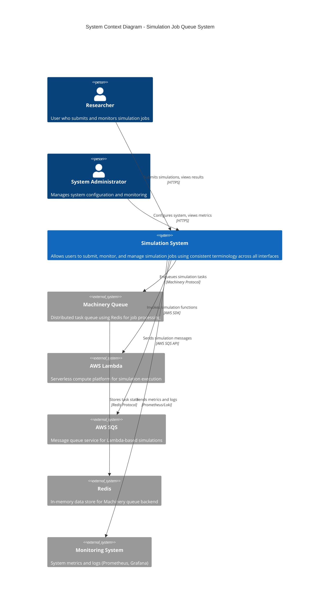
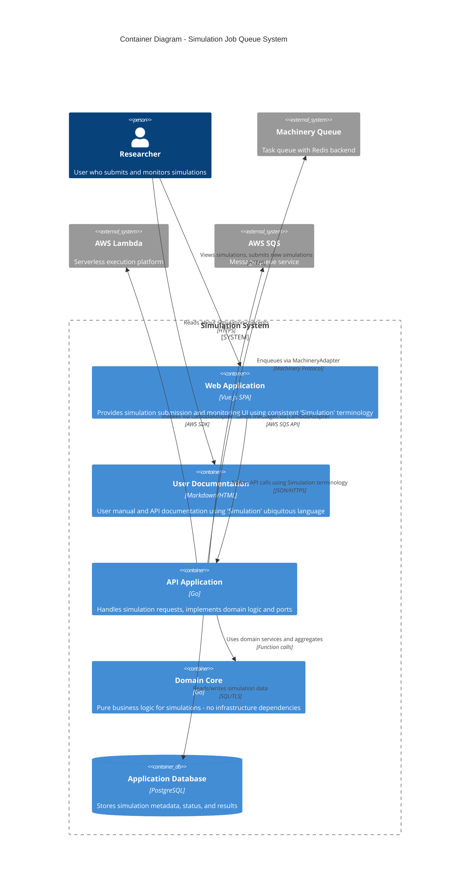
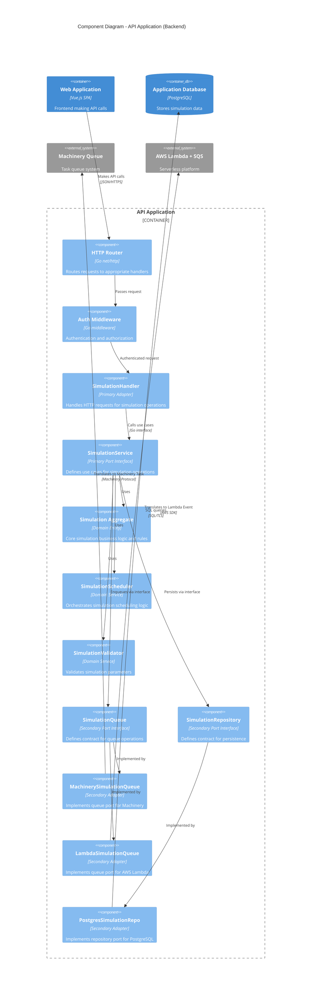
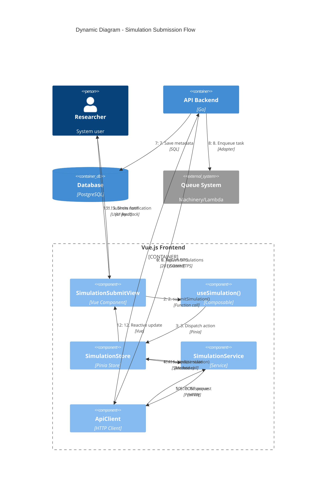
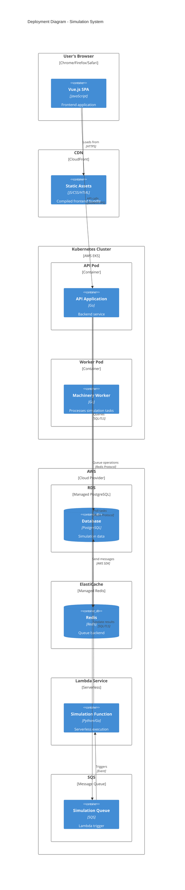
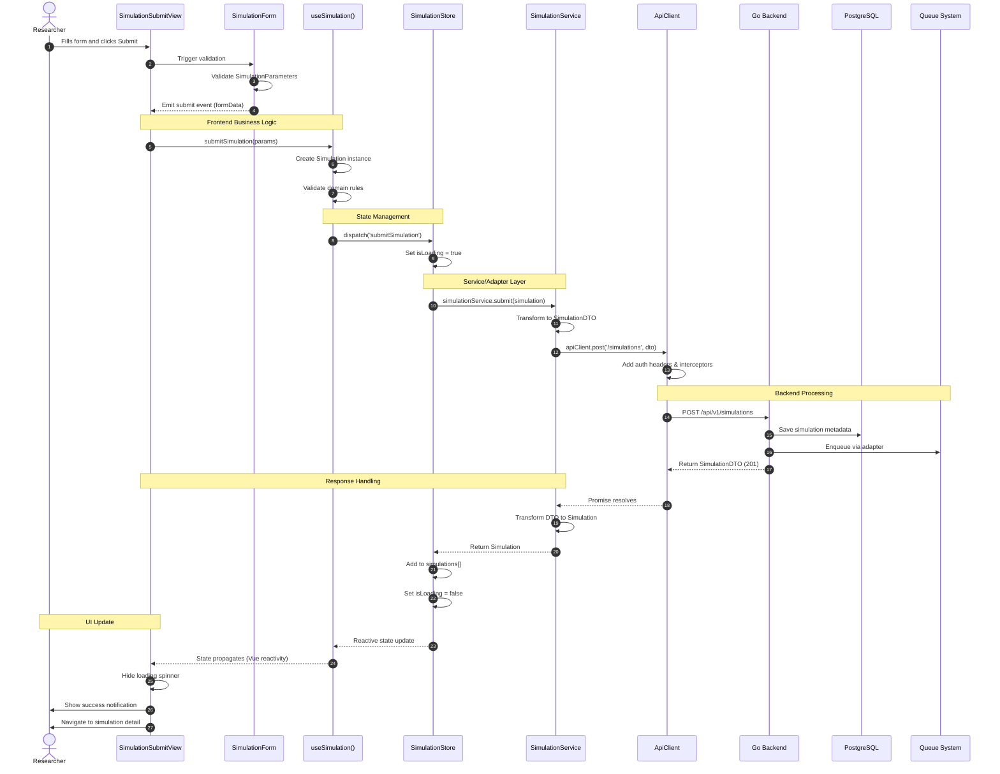
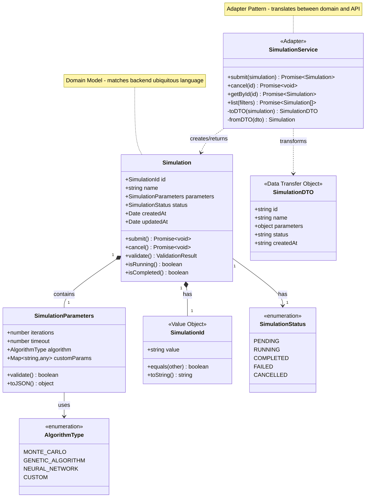
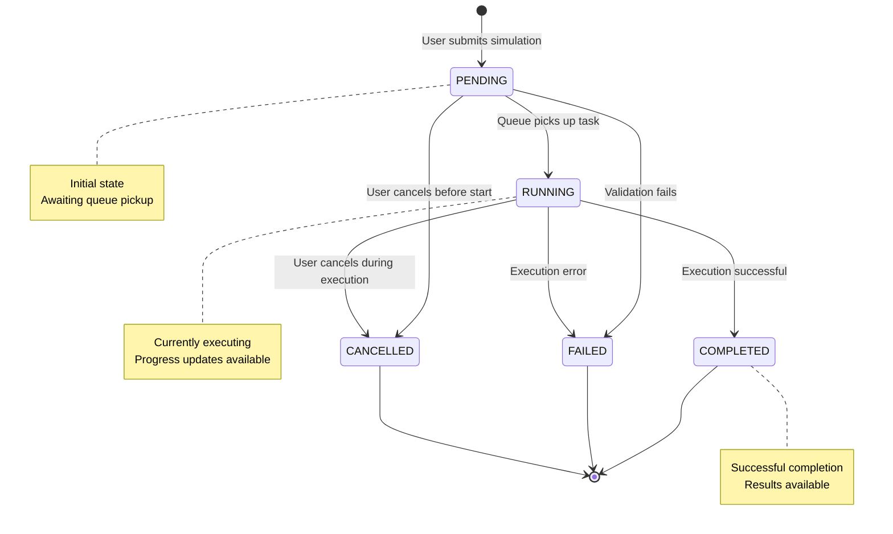

# Simulation Job Queue System - C4 Architecture Diagrams (Mermaid)

## 1. System Context Diagram (C1)

---

## 2. Container Diagram (C2)

---

## 3. Component Diagram - Backend API (C3)

---

## 4. Component Diagram - Frontend (C3 - Detailed)

```mermaid
C4Component
    title Component Diagram - Web Application (Vue.js Frontend)
    
    Person(researcher, "Researcher", "System user")
    
    Container_Boundary(spa, "Web Application - Vue.js SPA") {
        Component(router, "Vue Router", "Vue Router", "Client-side routing, navigation guards")
        
        Component(simListView, "SimulationListView", "Vue Component", "Displays list of simulations with filtering and sorting")
        Component(simDetailView, "SimulationDetailView", "Vue Component", "Shows detailed simulation information and logs")
        Component(simSubmitView, "SimulationSubmitView", "Vue Component", "Form for submitting new simulations")
        Component(dashboardView, "DashboardView", "Vue Component", "Overview with statistics and recent simulations")
        
        Component(simCard, "SimulationCard", "Vue Component", "Reusable card displaying simulation summary")
        Component(simForm, "SimulationForm", "Vue Component", "Reusable form with validation for simulation parameters")
        Component(simStatus, "SimulationStatusBadge", "Vue Component", "Visual status indicator")
        Component(simTable, "SimulationTable", "Vue Component", "Sortable, filterable table of simulations")
        
        Component(simStore, "SimulationStore", "Pinia Store Module", "Manages simulation state, actions, and getters")
        Component(authStore, "AuthStore", "Pinia Store Module", "Manages authentication state")
        Component(uiStore, "UIStore", "Pinia Store Module", "Manages UI state (loading, errors, notifications)")
        
        Component(apiClient, "ApiClient", "Service", "HTTP client wrapper with interceptors, error handling")
        Component(simService, "SimulationService", "Service", "Translates between API DTOs and domain models")
        Component(authService, "AuthService", "Service", "Handles authentication, token management")
        
        Component(useSimulation, "useSimulation", "Composable", "Reactive simulation operations (submit, cancel, refresh)")
        Component(useSimulationList, "useSimulationList", "Composable", "Reactive list operations (fetch, filter, sort)")
        
        Component(simModel, "Simulation", "TypeScript Interface", "Frontend domain model matching backend ubiquitous language")
        Component(simDTO, "SimulationDTO", "TypeScript Interface", "Data transfer object for API communication")
    }
    
    Container(api, "API Application", "Go", "Backend API")
    
    Rel(researcher, router, "Navigates to pages", "HTTPS")
    Rel(router, simListView, "Routes to")
    Rel(router, simDetailView, "Routes to")
    Rel(router, simSubmitView, "Routes to")
    Rel(router, dashboardView, "Routes to")
    
    Rel(simListView, simTable, "Uses", "Props & Events")
    Rel(simListView, simCard, "Uses", "Props & Events")
    Rel(simDetailView, simStatus, "Uses", "Props")
    Rel(simSubmitView, simForm, "Uses", "Props & Events")
    
    Rel(simListView, useSimulationList, "Uses", "Reactive data")
    Rel(simDetailView, useSimulation, "Uses", "Reactive data")
    Rel(simSubmitView, useSimulation, "Uses", "Reactive data")
    
    Rel(useSimulation, simStore, "Accesses/mutates")
    Rel(useSimulationList, simStore, "Accesses/mutates")
    
    Rel(simStore, simService, "Calls")
    Rel(authStore, authService, "Calls")
    
    Rel(simService, apiClient, "Makes HTTP requests")
    Rel(authService, apiClient, "Makes HTTP requests")
    
    Rel(simService, simModel, "Returns/accepts")
    Rel(simService, simDTO, "Transforms to/from")
    
    Rel(apiClient, api, "HTTP requests", "JSON/HTTPS")
    
    UpdateLayoutConfig($c4ShapeInRow="4", $c4BoundaryInRow="1")
```

---

## 5. Dynamic Diagram - Submission Flow (C4)

---

## 6. Deployment Diagram - System Deployment

---

## Alternative Diagrams (Non-C4 Mermaid)

### Sequence Diagram - Detailed Submission Flow

### Class Diagram - Domain Models

### State Diagram - Simulation Lifecycle

