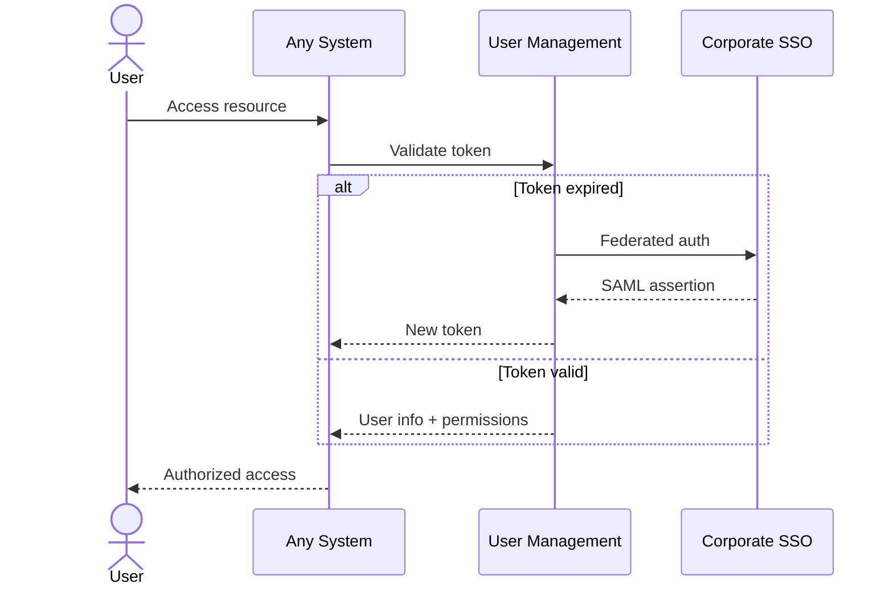
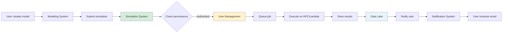
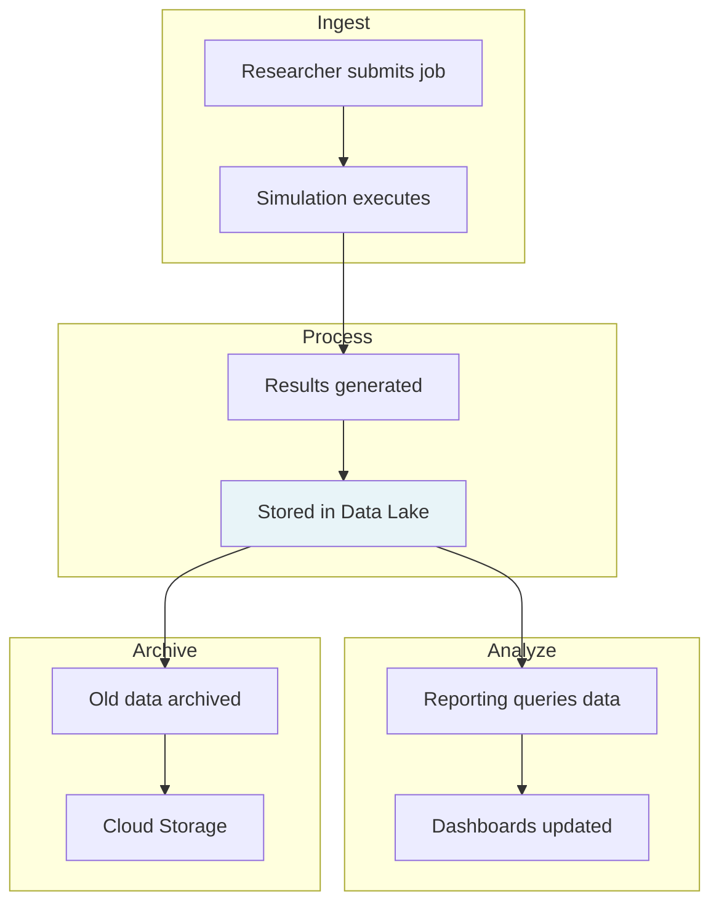

# System Landscape Diagram - Research & Simulation Platform

## C4 System Landscape (Mermaid)

```mermaid
C4Context
    title System Landscape Diagram - Research & Simulation Platform
    
    Person(researcher, "Researcher", "Conducts simulations and analyzes results")
    Person(admin, "Administrator", "Manages users and system configuration")
    Person(dataScientist, "Data Scientist", "Develops and trains models")
    Person(auditor, "Compliance Auditor", "Reviews system usage and access logs")
    
    Enterprise_Boundary(platform, "Research & Simulation Platform") {
        System(simSystem, "Simulation Job Queue System", "Manages submission, execution, and monitoring of simulation jobs using distributed queues")
        
        System(userMgmt, "User Management System", "Handles authentication, authorization, user profiles, and role-based access control")
        
        System(modelingSystem, "Modeling System", "Provides tools for creating, versioning, and managing simulation models and parameters")
        
        System(dataLake, "Data Lake System", "Stores and manages large-scale simulation results, raw data, and datasets for analysis")
        
        System(reportingSystem, "Reporting & Analytics System", "Generates reports, visualizations, and statistical analysis of simulation results")
        
        System(notificationSystem, "Notification System", "Sends email, SMS, and in-app notifications about simulation status and system events")
    }

    
    System_Ext(sso, "Corporate SSO", "SAML/OAuth2 identity provider (Okta, Azure AD)")
    System_Ext(billing, "Billing System", "Tracks resource usage and generates invoices")
    System_Ext(hpc, "HPC Cluster", "High-performance computing infrastructure for intensive simulations")
    System_Ext(cloudStorage, "Cloud Storage", "AWS S3/Azure Blob for long-term data archival")
    System_Ext(monitoring, "Monitoring Platform", "Prometheus, Grafana, ELK stack for observability")
    System_Ext(emailService, "Email Service", "SendGrid/SES for transactional emails")
    
    Rel(researcher, simSystem, "Submits and monitors simulations", "HTTPS/WebSocket")
    Rel(researcher, modelingSystem, "Creates and manages models", "HTTPS")
    Rel(researcher, reportingSystem, "Views reports and analytics", "HTTPS")
    
    Rel(dataScientist, modelingSystem, "Develops ML models", "HTTPS/API")
    Rel(dataScientist, dataLake, "Accesses training data", "HTTPS/S3 API")
    
    Rel(admin, userMgmt, "Manages users and permissions", "HTTPS")
    Rel(admin, simSystem, "Configures system settings", "HTTPS")
    
    Rel(auditor, userMgmt, "Reviews access logs", "HTTPS")
    Rel(auditor, reportingSystem, "Views audit reports", "HTTPS")
    
    Rel(simSystem, userMgmt, "Authenticates users, checks permissions", "REST API/gRPC")
    Rel(simSystem, modelingSystem, "Fetches model definitions", "REST API")
    Rel(simSystem, dataLake, "Stores simulation results", "S3 API")
    Rel(simSystem, notificationSystem, "Triggers status notifications", "Message Queue")
    Rel(simSystem, billing, "Reports resource usage", "REST API")
    Rel(simSystem, hpc, "Dispatches heavy compute jobs", "SSH/SLURM API")
    Rel(simSystem, monitoring, "Sends metrics and logs", "Prometheus/Loki")
    
    Rel(modelingSystem, userMgmt, "Authenticates users", "REST API")
    Rel(modelingSystem, dataLake, "Stores model artifacts", "S3 API")
    Rel(modelingSystem, monitoring, "Sends metrics and logs", "Prometheus/Loki")
    
    Rel(reportingSystem, simSystem, "Queries simulation data", "REST API/SQL")
    Rel(reportingSystem, dataLake, "Reads result datasets", "S3 API")
    Rel(reportingSystem, userMgmt, "Authenticates users", "REST API")
    
    Rel(dataLake, cloudStorage, "Archives old data", "S3 API")
    
    Rel(notificationSystem, emailService, "Sends emails", "SMTP/API")
    
    Rel(userMgmt, sso, "Federates authentication", "SAML/OAuth2")
    Rel(userMgmt, monitoring, "Sends metrics and logs", "Prometheus/Loki")
    
    UpdateLayoutConfig($c4ShapeInRow="3", $c4BoundaryInRow="1")
```

---

## System Overview

### Internal Systems (Research & Simulation Platform)

#### 1. **Simulation Job Queue System**
- **Purpose**: Core system for managing simulation workloads
- **Key Features**:
  - Job submission and queuing (Machinery/Lambda)
  - Distributed execution across multiple backends
  - Real-time status monitoring via WebSocket
  - Consistent "Simulation" ubiquitous language
- **Architecture**: Hexagonal/DDD with ports & adapters
- **Dependencies**: User Management, Modeling System, Data Lake, Notification
  System

#### 2. **User Management System**
- **Purpose**: Centralized identity and access management
- **Key Features**:
  - User registration, authentication, authorization
  - Role-based access control (RBAC)
  - SSO integration (SAML/OAuth2)
  - Audit logging and compliance
  - API key management for programmatic access
- **Technology**: Keycloak-based or custom Go service
- **External Integration**: Corporate SSO (Okta, Azure AD)

#### 3. **Modeling System**
- **Purpose**: Manage simulation models and configurations
- **Key Features**:
  - Model versioning (Git-like workflow)
  - Parameter templates and validation schemas
  - Model marketplace/library
  - Jupyter notebook integration
  - ML model registry
- **Technology**: Python/FastAPI backend with MLflow integration
- **Users**: Data Scientists, Researchers

#### 4. **Data Lake System**
- **Purpose**: Scalable storage for simulation data
- **Key Features**:
  - Object storage (S3-compatible)
  - Metadata catalog (Apache Iceberg/Delta Lake)
  - Data lifecycle management
  - Query engine (Presto/Trino)
  - Data versioning and lineage
- **Technology**: MinIO/S3 + Apache Iceberg
- **Scale**: Petabyte-scale storage

#### 5. **Reporting & Analytics System**
- **Purpose**: Business intelligence and data visualization
- **Key Features**:
  - Interactive dashboards (Grafana/Superset)
  - Statistical analysis
  - Custom report generation
  - Scheduled reports
  - Export to PDF/Excel
- **Technology**: Apache Superset or custom React/D3.js
- **Data Sources**: Simulation System, Data Lake

#### 6. **Notification System**
- **Purpose**: Multi-channel notification delivery
- **Key Features**:
  - Email, SMS, push notifications
  - Webhook integrations (Slack, Teams)
  - Notification preferences per user
  - Template management
  - Delivery tracking and retries
- **Technology**: Event-driven architecture with message queue
- **Patterns**: Publisher-Subscriber

### External Systems

#### 7. **Corporate SSO**
- **Examples**: Okta, Azure AD, Auth0
- **Protocol**: SAML 2.0, OAuth2/OIDC
- **Purpose**: Enterprise identity federation

#### 8. **Billing System**
- **Purpose**: Track resource consumption and costs
- **Integration**: Receives usage metrics from Simulation System
- **Features**: Chargeback, cost allocation, invoicing

#### 9. **HPC Cluster**
- **Purpose**: High-performance computing for intensive jobs
- **Examples**: SLURM, PBS, Kubernetes with GPU nodes
- **Interface**: SSH, REST API, batch submission

#### 10. **Cloud Storage**
- **Purpose**: Long-term archival (cold storage)
- **Examples**: AWS S3 Glacier, Azure Archive Storage
- **Lifecycle**: Automatic archival after 90+ days

#### 11. **Monitoring Platform**
- **Components**: Prometheus (metrics), Grafana (dashboards), ELK (logs)
- **Purpose**: Observability across all systems
- **Features**: Alerting, distributed tracing (Jaeger)

#### 12. **Email Service**
- **Examples**: SendGrid, AWS SES, Mailgun
- **Purpose**: Transactional email delivery
- **Usage**: Notifications, password resets, reports

---

## Key Architectural Patterns

### Cross-System Communication

1. **Synchronous**: REST APIs, gRPC for real-time operations
2. **Asynchronous**: Message queues (RabbitMQ, Kafka) for event-driven flows
3. **Data Integration**: S3 API for bulk data transfer

### Authentication Flow

### Simulation Workflow

### Data Flow

---

## System Boundaries & Responsibilities

| System | Primary Responsibility | Technology Stack | Scale |
|--------|----------------------|------------------|-------|
| **Simulation Job Queue** | Job orchestration | Go, Vue.js, Redis/Lambda | 10K+ jobs/day |
| **User Management** | Identity & access | Keycloak/Go, PostgreSQL | 10K+ users |
| **Modeling System** | Model lifecycle | Python/FastAPI, MLflow | 1K+ models |
| **Data Lake** | Data storage & query | S3/MinIO, Iceberg, Trino | Petabyte scale |
| **Reporting & Analytics** | BI & visualization | Superset, PostgreSQL | 100+ dashboards |
| **Notification System** | Message delivery | Go, RabbitMQ, Redis | 100K+ msgs/day |

