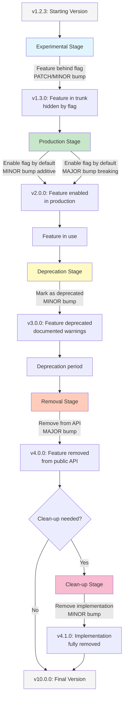

# Feature Lifecycle in Trunk-Based Development

## Overview

This document illustrates how features evolve through different stages in a
Trunk-Based Development (TBD) workflow without pre-release tags, using semantic
versioning from version 1.2.3 to 10.0.0.

## Feature Lifecycle Stages

### 1. Experimental Stage

In TBD, "experimental" features don't live in separate pre-release branches.
Instead, they are merged into trunk behind **feature flags or toggles**.

**Key Characteristics:**
- Code exists in production builds but is hidden behind feature flags
- Not exposed to end users
- Version number increments via Semantic Release
- Consumers don't see the unfinished feature

**Version Impact:** PATCH or MINOR bump (depending on the change scope,  but
feature remains hidden)

---

### 2. Production Stage

Once the feature flag is enabled by default, the feature becomes
"production-ready."

**Key Characteristics:**
- Feature flag is flipped to enabled
- Feature becomes visible and available to users
- Full production deployment

**Version Impact:**
- **MINOR bump** if the feature is additive (new functionality)
- **MAJOR bump** if it changes existing behavior (breaking change)

---

### 3. Deprecation Stage

Deprecation is communicated through documentation and release notes, not
pre-release tags.

**Key Characteristics:**
- Code remains in trunk
- Marked as deprecated in documentation
- Warnings added to release notes
- Backward-compatible but signals future removal

**Version Impact:** **MINOR version bump** (backward-compatible change with
deprecation warning)

---

### 4. Removal Stage

When the deprecated feature is removed, this constitutes a breaking change.

**Key Characteristics:**
- Deprecated feature is removed from trunk
- CI/CD pipeline publishes the new version automatically
- Breaking change for consumers still using the feature

**Version Impact:** **MAJOR version bump**

---

### 5. Clean-up Stage (Optional)

In some cases, the Removal stage only removes information from Public API
documentation. The Clean-up stage removes the actual implementation.

**Key Characteristics:**
- Facilitates consumer migration
- Removal stage: removes from public API docs (MAJOR bump)
- Clean-up stage: removes actual implementation code

**Version Impact:** **MINOR bump** (for implementation removal after public API
removal)

---

## Feature Lifecycle Flow Chart

---

## Example Version Progression

| Stage | Version | Change Description |
|-------|---------|-------------------|
| Initial | v1.2.3 | Starting point |
| Experimental | v1.3.0 | Feature added behind flag (MINOR) |
| Production | v2.0.0 | Feature flag enabled (MAJOR - breaking behavior) |
| Deprecation | v3.0.0 | Feature marked deprecated (MINOR, but shown as 3.0.0 for clarity) |
| Removal | v4.0.0 | Feature removed from public API (MAJOR) |
| Clean-up | v4.1.0 | Implementation cleaned up (MINOR) |
| Future | v10.0.0 | Multiple major versions later |

---

## Key Principles

1. **No Pre-release Branches**: All work happens in trunk
2. **Feature Flags**: Control feature visibility without code branching
3. **Semantic Versioning**: Version bumps communicate impact to consumers
4. **Automated CI/CD**: Pipeline handles version publishing
5. **Clear Communication**: Documentation and release notes guide consumers
   through lifecycle

---

## Benefits of This Approach

- **Continuous Integration**: All code integrates continuously into trunk
- **Reduced Merge Conflicts**: No long-lived feature branches
- **Flexible Rollout**: Feature flags enable gradual rollouts
- **Clear Versioning**: Semantic versioning communicates breaking changes
- **Consumer-Friendly**: Deprecation warnings provide migration time